# 🎄 SnowParty Arena — локальная новогодняя игра

Локальное новогоднее соревнование в домашней сети: Django + Channels на бэкенде, React (Vite) на фронтенде. Телевизор показывает табло с рейтингом и прогрессом игроков, гости играют с телефонов через QR-код.

## 📸 Скриншоты игры

### 01 — Старт и подключение игроков

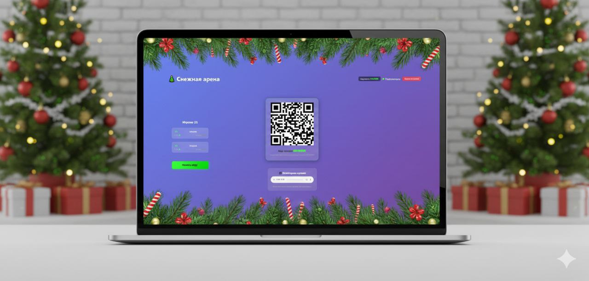

Экран ведущего на ПК/телевизоре. Игроки подключаются через QR-код на своих устройствах. После подключения сразу видно, кто подключился. Это страница ведущего, который начинает игру. Здесь отображается рейтинг и список подключенных игроков.

---

### 1 — Экран ведущего (виден всем гостям)

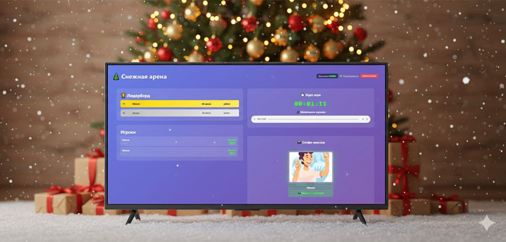

Главный экран ведущего, который виден всем гостям. Здесь отображается:
- **Рейтинг игроков** — текущие места и очки
- **QR-код** — для подключения новых игроков
- **Фейерверк** — появляется после подключения игроков
- **Карусель с селфи** — как только один из игроков получит задание с селфи и выполнит его, появляется каруселька с его селфи. Чем больше игроков выполнит задание, тем больше картинок с селфи появится

---

### 2 — Экран ожидания у игроков

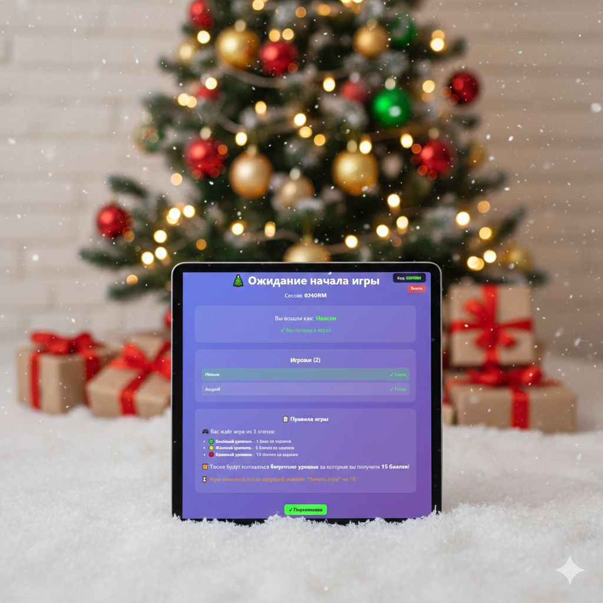

Экран ожидания игроков на их устройствах. Пока игроки не будут готовы и ведущий не нажмет "Начать игру", данная страница будет отображаться у игрока. Здесь игрок видит список подключенных участников и ждет начала игры.

---

### 3 — Финальный рейтинг

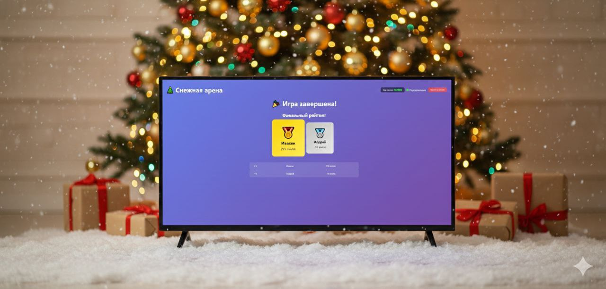

Этот экран появляется, когда все участники прошли все этапы. На экране ведущего появляется финальный рейтинг: кто какое место занял и сколько баллов набрал.

---

### 4, 41 — Первая игра зелёного уровня

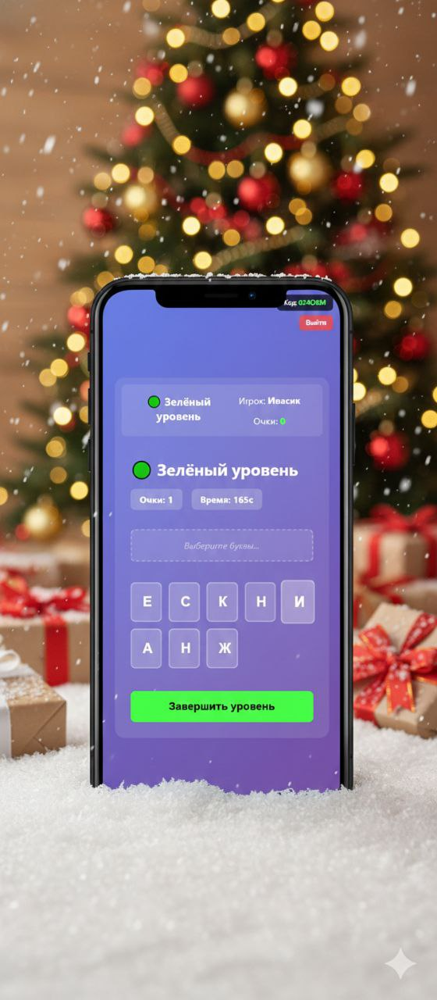
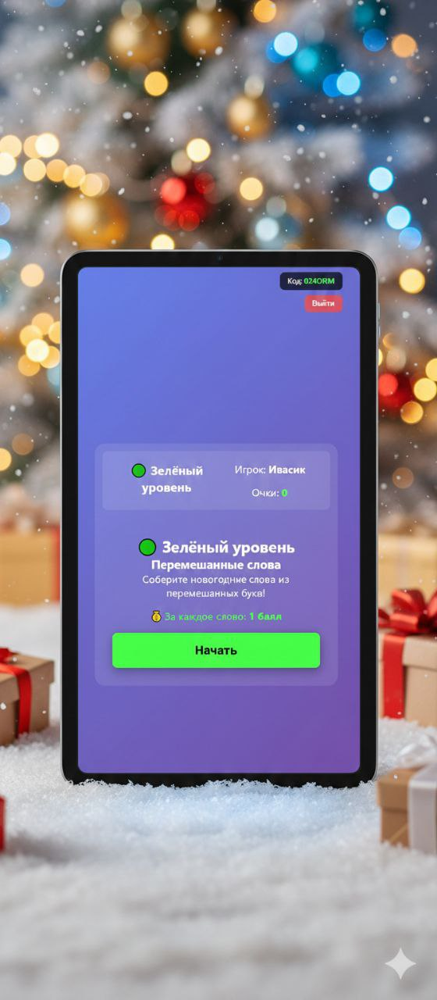

Самая первая игра в зелёном уровне. Необходимо собрать слова из перемешанных букв. Время ограничено, нужно быть внимательнее.

---

### 5, 6 — Бонусный уровень с селфи

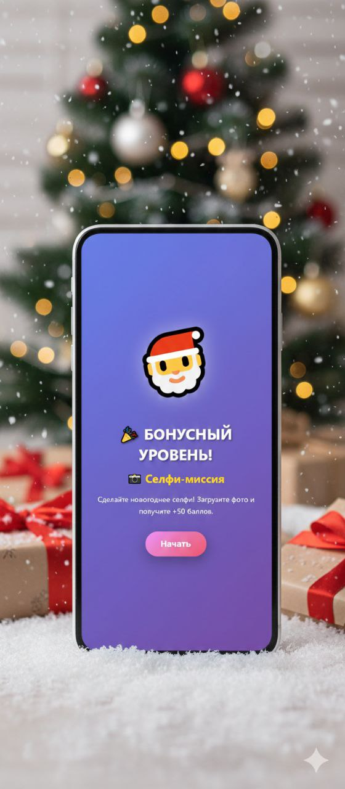
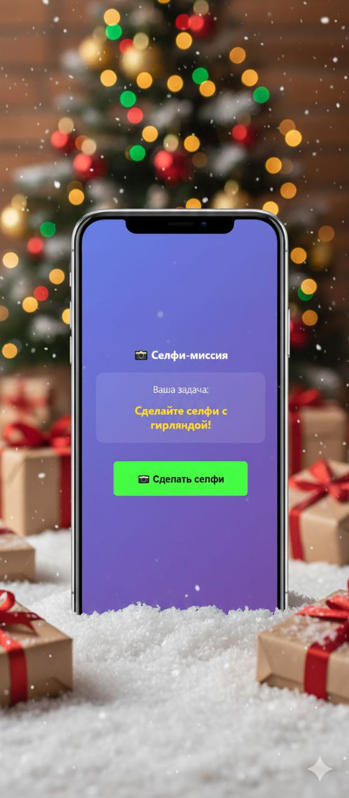

Бонусный уровень с селфи, за выполнение которого дается 50 баллов. Игрок получает задание (например, "сделай селфи с ёлкой") и должен выполнить его, загрузив фотографию.

В игре есть еще несколько бонусных уровней, которые попадаются рандомно на протяжении всего мероприятия.

---

### 7 — Бонусные уровни (снежинки и другие)

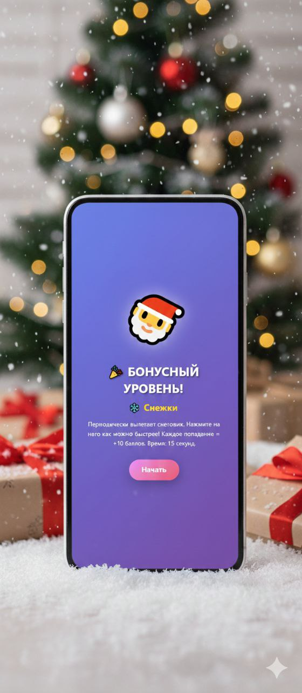

Примеры других бонусных уровней, которые появляются случайным образом. Например, игра со снежинками, где нужно быстро реагировать и получать дополнительные баллы.

---

### 8 — Тап-батл

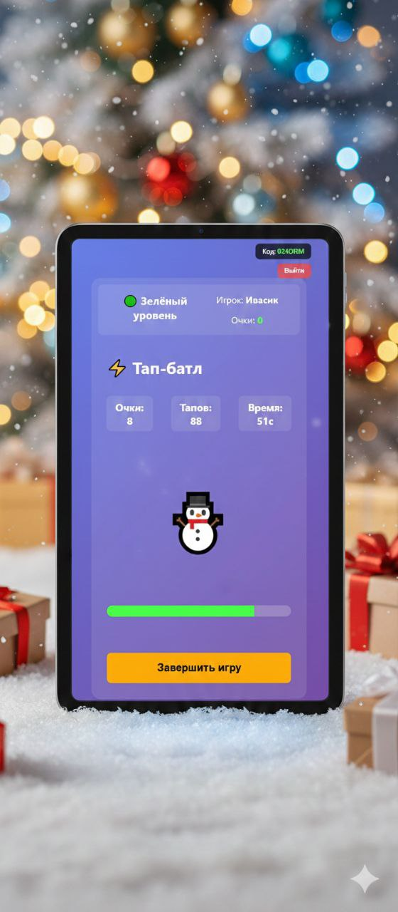

Простая игра для разгрузки. За каждые 10 тапов дается 1 балл. Игрок должен как можно быстрее нажимать на экран, чтобы набрать максимальное количество очков.

---

### 9 — Описание игры перед началом

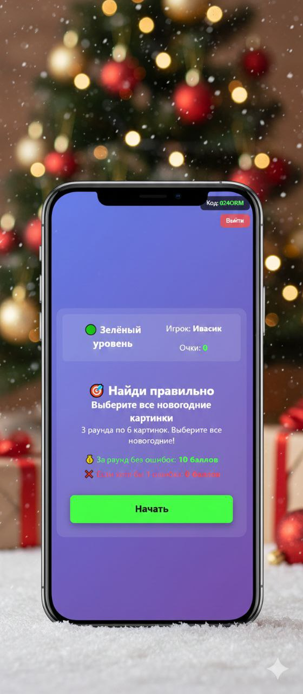

Перед любой игрой появляется экран с описанием самой игры и кнопкой "Начать". Здесь игрок может ознакомиться с правилами и подготовиться к выполнению задания.

---

## 🚀 Быстрый старт

### 1. Backend (Django + Channels)

```bash
cd backend

# Создать виртуальное окружение
python -m venv .venv

# Активировать (Windows)
.venv\Scripts\activate

# Активировать (Linux/Mac)
source .venv/bin/activate

# Установить зависимости
pip install -r requirements.txt

# Применить миграции
python manage.py migrate

# Создать суперпользователя (опционально)
python manage.py createsuperuser

# Запустить сервер (ASGI через daphne)
daphne -b 0.0.0.0 -p 8000 snowparty.asgi:application

# Или через manage.py (для разработки)
python manage.py runserver 0.0.0.0:8000
```

### 2. Frontend (React + Vite)

```bash
cd frontend

# Установить зависимости
npm install

# Запустить dev-сервер (с доступом по сети)
npm run dev -- --host

# Или собрать для production
npm run build
npm run preview -- --host
```

### 3. Доступ к приложению

- **ТВ экран**: `http://<IP_ноутбука>:5173/tv?session=<код>`
- **Экран игрока**: `http://<IP_ноутбука>:5173/play?session=<код>`
- **API**: `http://<IP_ноутбука>:8000/api/`

При первом открытии `/tv` автоматически создаётся новая сессия и генерируется QR-код.

## 🎮 Как играть

1. **Старт**: Откройте `/tv` на телевизоре → появится QR-код
2. **Регистрация**: Гости сканируют QR → вводят имя → попадают в список
3. **Запуск**: Когда набралось минимум игроков → нажмите "Начать игру" на ТВ
4. **Игра**: Игроки проходят уровни (зелёный → жёлтый → красный)
5. **Финал**: После завершения всех уровней показывается финальный рейтинг

## 📡 API Endpoints

- `POST /api/session` — создать сессию
- `GET /api/session/<code>` — получить состояние сессии
- `GET /api/session/<code>/selfies` — получить все селфи сессии
- `POST /api/session/<code>/join` — зарегистрировать игрока
- `POST /api/session/<code>/start` — начать игру
- `POST /api/progress` — отправить результат уровня
- `POST /api/selfie/upload` — загрузить селфи игрока

## 🔌 WebSocket

Подключение: `ws://<host>:8000/ws/session/<code>/`

События:
- `session.state` — состояние сессии
- `players.list` — список игроков
- `player.update` — обновление игрока
- `leaderboard.update` — обновление лидерборда
- `game.event` — игровые события (включая загрузку селфи)

## 🎯 Игровые уровни

### 🟢 Зелёный (лёгкий)
- **Перемешанные слова** — собрать новогоднее слово из букв (3 минуты)
- **Выбери новогодние картинки** — найти правильные изображения (3 раунда по 6 картинок)
- **Тап-батл** — нажать как можно больше за 1 минуту (1 балл за каждые 10 тапов)

### 🟡 Жёлтый (средний)
- **Правда или Ложь** — 10 вопросов о Новом годе (+5 баллов за правильный ответ)
- **Шарады** — собрать 3 пазла (+5 баллов за каждый)
- **Найди правильную ёлочную игрушку** — визуальное задание на внимание (4-5 раундов по 5 секунд)

### 🔴 Красный (сложный)
- **Реакция и ловля** — поймать правильные предметы, избежать опасных (60 секунд, 3 жизни, +10 баллов за правильный)
- **Шифровка** — разгадать загадку по подсказкам (3 подсказки, базовые 10 баллов + бонус)
- **Саймон** — повторить последовательность цветов (10 баллов × уровень)

## 🎁 Бонусные уровни

Бонусные уровни появляются случайным образом (30% вероятность) между основными играми:

- **Поймай подарки** — тапай по падающим подаркам для получения баллов
- **Снежки** — нажми на периодически появляющегося снеговика для бонуса
- **Рулетка удачи** — крути рулетку для получения баффов/дебаффов
- **Селфи-миссия** — сделай селфи с новогодним предметом (+50 баллов, 100% вероятность в зелёном уровне, если еще не играли)

## 🛠️ Разработка

### Структура проекта

- `backend/` — Django-проект с Channels, REST/WS API
- `frontend/` — Vite + React, два маршрута `/tv` (табло) и `/play` (игрок)
- `media/` — загруженные файлы (селфи игроков)
- `docs/` — архитектура и протокол сообщений

### Переменные окружения (backend)

Создайте `backend/.env`:
```
SECRET_KEY=your-secret-key-here
DEBUG=True
```

### Структура базы данных

- `Session` — игровая сессия
- `Player` — игрок
- `Progress` — прогресс по уровням
- `Selfie` — загруженные селфи игроков
- `LeaderboardSnapshot` — снимки лидерборда

## 🛠️ Технологии

- **Backend**: Django 5.1+, Channels 4.0+, daphne
- **Frontend**: React 18, Vite, React Router
- **WebSocket**: Django Channels с in-memory channel layer
- **Хранение файлов**: Django Media Files (селфи сохраняются в `media/api/upload/`)

## 📝 Формат сохранения селфи

Селфи сохраняются с форматом имени файла:
```
{session_code}_{datetime}_{player_name}_{selfie_id}.{ext}
```

Пример: `RUBPSH_20251209_220703_Ан_f45cd792.jpg`

## 📄 Лицензия

MIT
